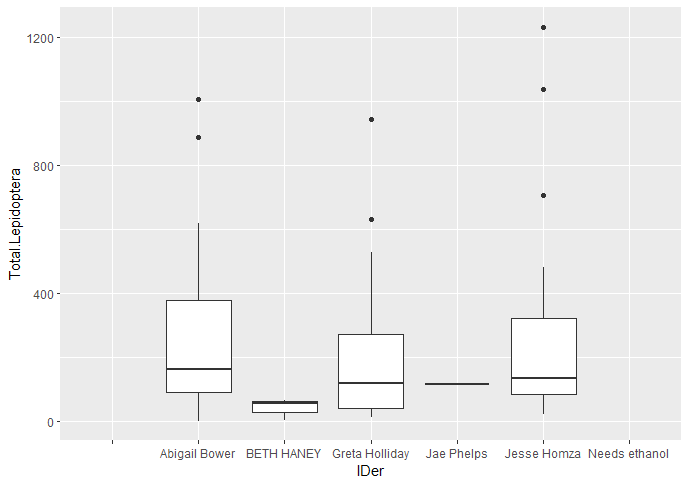

# insect_pioneers
Draft for insect processing.
raw data 
https://docs.google.com/spreadsheets/d/1bxomsGCl0l772rs5AFu4KF3RiZcjo7sjs3l2i0RmOqg/edit#gid=0

task one: prioritize identification.

- in order to prioritize we need to clean the column sites fix spellings or other issues. (partially solved: we need to fix spellings)

- there was a date that was need change of format: IRON04 Aug 10 2021 

11/14/2023
Working with Greta I realized that we need to double check each row from the main table. Aparelty there are some mistakes with the data. Some rows were entered in the wrong sites. To fix this, we need to go through each of the 

I think I have the priority table for all the sites. Maybe having samples each two weeks should be enough for the rest of the samples. 

Interesting graphs:
this is a graph of insects by IDer

